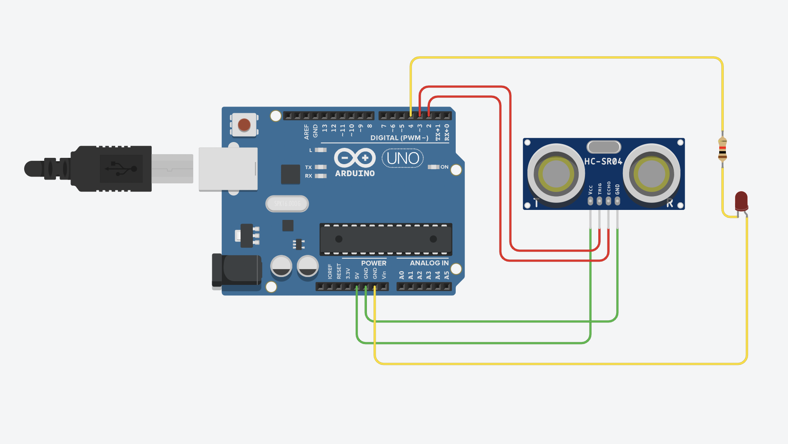

# Magic-Knob
Projet Arduino de contrôleur MIDI via un capteur de distance.

Le capteur de présence à ultrason détectera la distance jusqu'à 64cm du capteur et la convertit en signal MIDI interprétable par un logiciel tel que <a href="https://projectgus.github.io/hairless-midiserial/">Hairless MIDI</a>.

En association avec un logiciel de port MIDI virtuel comme <a href="https://www.tobias-erichsen.de/software/loopmidi.html">loopMIDI</a>, il est possible de connecter le Magic Knob à n'importe quel STAN (DAW) ou logiciel contrôlable via Contrôleur MIDI.

Projet mené à bien en une semaine en collaboration avec <a href="https://github.com/GabrielLCSC">Gabriel Dautreppe</a> & <a href="https://github.com/albanledev">Alban de Braquilanges</a>
